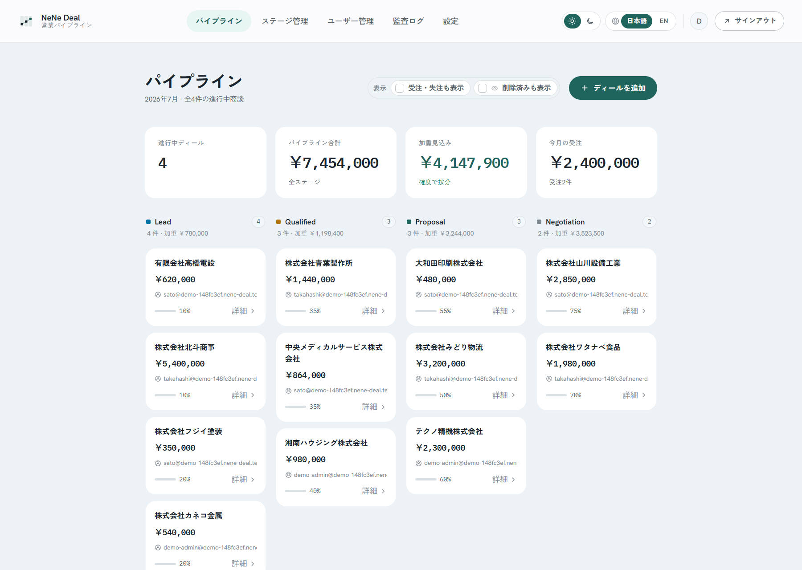
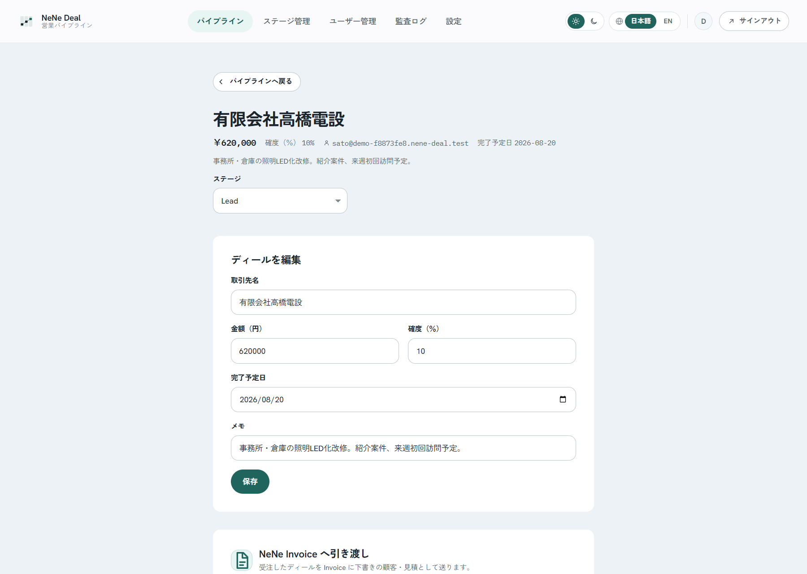
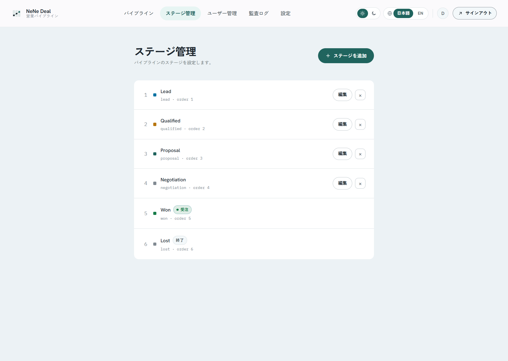
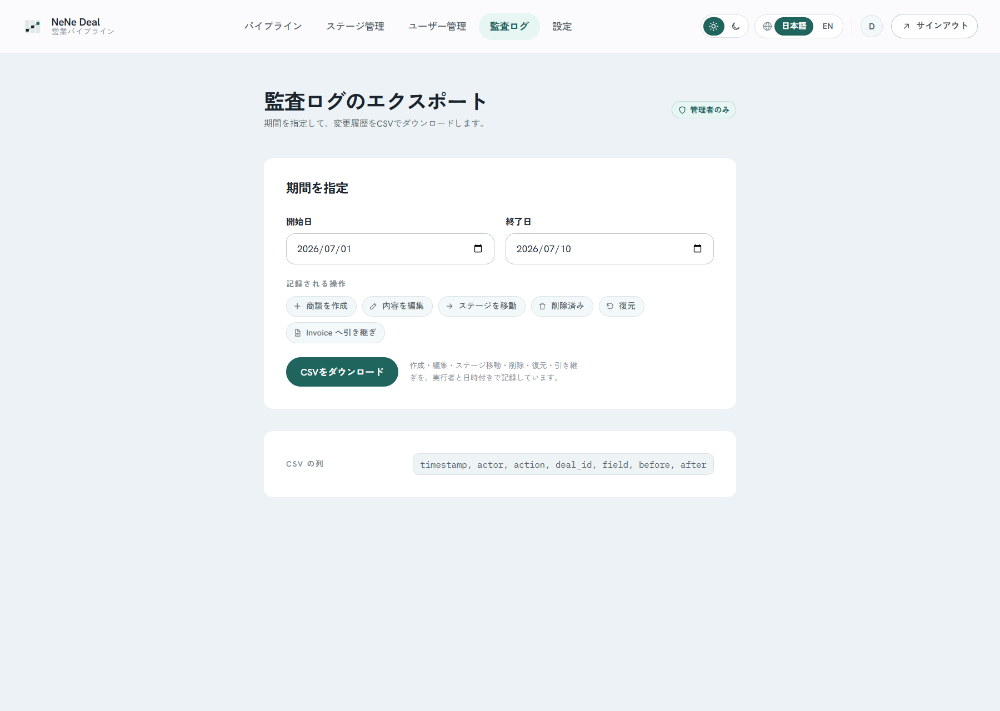

# NeNe Deal

[](./LICENSE)
[](https://www.php.net/)

**Ultra-light B2B deal pipeline — kanban, forecast, handoff to billing.**

NeNe Deal is a **self-hosted sales pipeline** for small B2B teams: deal cards,
stages, probability, and a rough monthly forecast — without Salesforce-scale
complexity. When a deal is **won**, operators push a **draft client and quote**
to [NeNe Invoice](https://github.com/hideyukiMORI/nene-invoice) over HTTP.
Built on [NENE2](https://github.com/hideyukiMORI/NENE2).

> **Pipeline SSOT, not billing SSOT.** Deal owns **opportunity state** only.
> Quotes, invoices, tax, and qualified invoice rules live in **NeNe Invoice**.
> Reconciliation, bank matching, and dunning live in **NeNe Clear** — not here.
> See [ADR 0002](./docs/adr/0002-deal-is-pipeline-ssot-not-billing.md).

## Domain (binding)

| Product | Repository | What it owns |
| --- | --- | --- |
| **NeNe Deal** | `nene-deal` (this) | Deals, stages, pipeline forecast |
| **NeNe Invoice** | `nene-invoice` | Clients, quotes, invoices, payments |
| **NeNe Clear** | `nene-clear` | Reconciliation & dunning (downstream of Invoice) |
| **NeNe Vault** | `nene-vault` | Received-document archive |
| **NeNe Records** | `nene-records` | Flexible CMS / catalog (optional upstream) |

## Live demo

Try it now — no sign-up. The link provisions a **brand-new disposable organization** seeded with 15 deals across the pipeline and drops you straight into its kanban board. Demo organizations are deleted automatically after about 3 hours. The bearer token is held in memory only, so reloading the page signs you out — hit the link again for a fresh organization.

- <https://deal.ayane.co.jp/demo/standard>

### Screenshots

From a disposable demo organization. Japanese UI shown — the admin UI is bilingual (ja/en, one-click switch).

**Pipeline board — open deals, pipeline total, probability-weighted forecast, and won-this-month KPI tiles above a funnel-shaped kanban.**



**Deal detail — amount, probability, expected close date, and stage edited inline; a won deal is pushed to NeNe Invoice as a draft client and quote.**



**Stage management — six default stages from Lead to Won / Lost with won and closed badges; rename, reorder, add, or remove stages to match your sales process.**



**Audit export — every create, edit, stage move, delete, restore, and Invoice handoff recorded with actor and timestamp, downloadable as CSV for any date range.**



## Goals

- **Minimal input** — deal card: account label, amount, stage, probability, short note
- **Kanban + monthly landing** — executive-friendly pipeline view
- **Won → Invoice** — explicit HTTP handoff to draft client / quote (operator confirms)
- **Separate database** — no shared tables with Invoice or Clear
- **Bilingual (JA/EN)** — Japanese default, English for foreign operators in Japan ([ADR 0004](./docs/adr/0004-bilingual-ja-en-only.md))
- **NENE2 consumer** — OpenAPI-first, Handler → UseCase → Repository

## Documentation (read first)

| Topic | Document |
| --- | --- |
| Agent entry | [`AGENTS.md`](./AGENTS.md) |
| Scope contract (binding) | [`docs/explanation/scope-contract.md`](./docs/explanation/scope-contract.md) |
| Terminology (binding) | [`docs/explanation/terminology.md`](./docs/explanation/terminology.md) |
| Product vision | [`docs/explanation/product-vision.md`](./docs/explanation/product-vision.md) |
| Domain model | [`docs/explanation/domain-model.md`](./docs/explanation/domain-model.md) |
| API contract (SSOT) | [`docs/openapi/openapi.yaml`](./docs/openapi/openapi.yaml) |
| Invoice handoff contract | [`docs/integrations/invoice-handoff-contract.md`](./docs/integrations/invoice-handoff-contract.md) |
| Sibling products | [`docs/integrations/sibling-products.md`](./docs/integrations/sibling-products.md) |
| MCP local server | [`docs/integrations/mcp-local-server.md`](./docs/integrations/mcp-local-server.md) |
| MCP tool catalog | [`docs/mcp/tools.json`](./docs/mcp/tools.json) |
| NENE2 inheritance | [`docs/inheritance-from-nene2.md`](./docs/inheritance-from-nene2.md) |
| Workflow | [`docs/workflow.md`](./docs/workflow.md) |
| DB backup / restore (production) | [`docs/operations/backup-restore.md`](./docs/operations/backup-restore.md) |
| Current work | Private mirror `nene-origin/internal-docs/deal/todo/` (operational logs migrated per P3 — see AGENTS.md) |
| Roadmap | [`docs/roadmap.md`](./docs/roadmap.md) |

## Pipeline position

```text
[ NeNe Deal ]  opportunity / stage / forecast (this repo)
       │  HTTP — won deal → draft client + quote (explicit)
       ▼
[ NeNe Invoice ]  billing SSOT
       │
[ NeNe Clear ]    reconciliation (separate product; not implemented here)
```

## Local development

### Docker (API + MySQL)

```bash
docker compose build
docker compose up -d
docker compose exec app composer install        # first run only
docker compose exec app composer migrations:migrate
curl -i http://localhost:8110/health            # {"status":"ok","checks":{"database":"ok"}}
```

The stack runs the PHP app (Apache, docroot `public_html/`) against a MySQL 8.4
service. DB settings are fixed in `compose.yaml` for the in-compose database, so a
host `.env` used for sqlite `php -S` development does not affect the container.

**Local dev ports are fixed and family-unique** (NeNe Deal owns the `81**`
block): app `8110`, MySQL `3310`, Vite `5187`, Storybook `6106`. Override the
host ports with `NENE_DEAL_PORT` / `NENE_DEAL_DB_PORT`. See the
[`AGENTS.md` port table](./AGENTS.md#local-dev-ports) for the full family map.

### Frontend

```bash
npm install --prefix frontend
npm run dev --prefix frontend     # Vite dev server, proxies /api to the app
npm run mock --prefix frontend    # MSW-backed dev server (no PHP needed)
npm run check --prefix frontend   # type-check, lint, format, test, knip, storybook
```

## License

MIT — see [`LICENSE`](./LICENSE).
